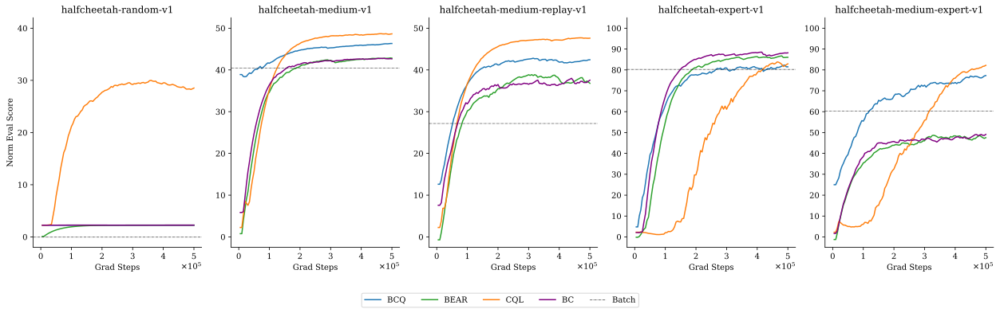
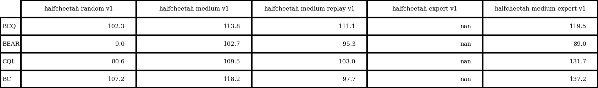

# BC, BCQ, BEAR和CQL在D4RL halfcheetah-v1上的复现

## 超参数

-   BC: 可见`brac/scripts/train_bc.py`
-   BCQ: 可见`bcq/scripts/run_script.py`
-   BEAR: 可见`bear/examples/bear_hdf5_d4rl.py`和`bear/README.md`
-   CQL: 可见`cql/d4rl/examples/cql_mujoco_new.py`和`bash_scripts/cql_d4rl_halfcheetah.sh`

## 训练曲线

方法：

-   从训练曲线的x坐标可见，所有算法训练的grad steps均为500K，和D4RL论文符合。
-   Norm eval score的计算方法为：（复现所得分数-随机策略的分数）/（专家策略的分数-随机策略的分数）；其中随机策略的分数和专家策略的分数可以在https://github.com/rail-berkeley/d4rl/blob/master/d4rl/infos.py中找到。
-   由于算力限制，每个算法在每个数据集上只跑了一个random seed——有待加强。

结论：

-   random: CQL似乎是唯一一个大大超过BC表现的算法。
-   medium-replay和medium-expert: 当较高质量的数据混入次等数据时，BCQ和CQL似乎受影响较小，BC和BEAR似乎受影响较大。
-   expert: 所有算法的“基本功”，但CQL收敛好像比较慢。

## 与D4RL论文中的结果进行比较

方法：

-   由于D4RL论文中并未在expert数据上训练算法，所以expert的一列全部为nan。
-   以下表格中每个分数的计算方法：复现所得分数（normalized）/  论文中的分数（normalized）* 100

结论：

-   BEAR在halfcheetah-random-v1上的复现表现与论文表现相差较大。

